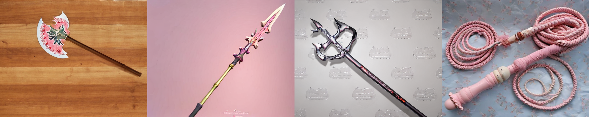

# Stable Diffusion v1.5 LoRA
Stable Diffusion v1.5 LoRA fine-tuning weapon image generation record (axe, spear, trident, whip)



## Introduction
- Stable Diffusion is a latent text-to-image diffusion model capable of generating photo-realistic images given any text input. The Stable-Diffusion-v1-5 checkpoint was initialized with the weights of the Stable-Diffusion-v1-2 checkpoint and subsequently fine-tuned on 595k steps at resolution 512x512 on "laion-aesthetics v2 5+" and 10% dropping of the text-conditioning to improve classifier-free guidance sampling.
- LoRA : Low rank adaptation of LLMs or Stable Diffusion models, which is a training technique to fine tune these models while maintain manageable file sizes. It applies smaller changes to standard checkpoint models, resulting in a reduced file size about 2-500MB, much smaller than checkpoint size(about 5GB)

## Requirements
Local running configs
- Windows 10 system
- RTX A5000(VRAM 24G)
- PyTorch : 2.0.1+cu118
- CUDA : 11.8
- Python 3.10.6
- necessary packages : `pip install -r requirements.txt`

## Process
Here I chose Stable Diffusion v1.5 as the base model and collected different weapon images as dataset(axe, spear, trident and whip). After training, the model could generate 4 kinds of weapons with pink blossom patterns on them.

### Data collection
In the `dataset/axe` folder, the axe images for training were uploaded as an example. For each kind of weapon, 100 photos were collected then labeled in `metadata.jsonl`. I preferred images with different backgrounds, lighting conditions, angles, and perspectives to make the model more robust and versatile, so I used Photoshop to simplify some complex backgrounds including watermarks and some strange lines.

### Model
The model is on huggingface [runwayml/stable-diffusion-v1-5](https://huggingface.co/runwayml/stable-diffusion-v1-5). 

v1-5-pruned.ckpt - 7.7GB, ema+non-ema weights. uses more VRAM - suitable for fine-tuning is needed.

### Training
Using `train_text_to_image_lora.py`, I trained the model with the following commands:
```
accelerate launch train_text_to_image_lora.py `
  --pretrained_model_name_or_path="D:\models--runwayml--stable-diffusion-v1-5" `
  --resolution=512 --center_crop --random_flip `
  --train_batch_size=1 `
  --gradient_accumulation_steps=4 `
  --gradient_checkpointing `
  --mixed_precision="fp16" `
  --max_train_steps=15000 `
  --learning_rate=1e-05 `
  --max_grad_norm=1 `
  --lr_scheduler="constant" --lr_warmup_steps=0 `
  --output_dir="D:\weapon\axe_output" `
  --num_train_epochs=600 `
  --train_data_dir="D:\weapon\axe"
```
After 15000 steps which took about 2.5h in my environment, I got the output `pytorch_lora_weights.bin`

### Weapon images generation
Using `weapon_generation.py`, after setting up img_num, prompt, negative_prompt, width, height and other parameters, the weapon images are generated. 

## References
1. [Stable Diffusion 微调及推理优化](https://cloud.tencent.com/developer/article/2302436)
2. [Using LoRA for Efficient Stable Diffusion Fine-Tuning](https://huggingface.co/blog/lora)
3. [runwayml/stable-diffusion-v1-5](https://huggingface.co/runwayml/stable-diffusion-v1-5)
